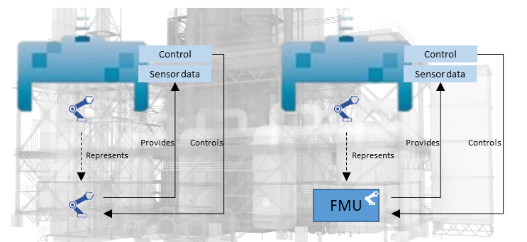

### What is BaSyx

	

	Eclipse BaSyx is the open source platform for next generation automation. It implements key concepts defined by Platform Industrie 4.0, such as the Asset Administration Shell as standardized <a href="https://www.iese.fraunhofer.de/en/services/digital-twin.html" target="_blank">digital twin</a>.  
	Our mission is to provide a free software platform that enables all interested parties, large and small companies, research institutes, academia, and interested persons, to participate in and to shape the fourth industrial revolution. We believe that the availability of a free reference technology platform is a key success factor for the Industrie 4.0.
	
	  
	
	Eclipse BaSyx therefore provides common and re-useable off-the shelf Industrie 4.0 components and SDKs (Java, C# and C++) that support the implementation of new Industrie 4.0 software components to enable rapid development of Industrie 4.0 solutions. BaSyx furthermore supports reference application scenarios for common Industrie 4.0 challenges such as a changeable production to enable individualized goods, leveraging big data analytics and connecting heterogeneous devices and systems while minimizing downtime and other associated costs.
	
	  

    In the following video Frank Schnicke (Fraunhofer IESE) is explaining the Eclipse BaSyx middleware by using a model factory (English subtitles provided).
    

	<!--

	Eclipse BaSyx is actively supported by the <a href="https://www.basys40.de/" title=""> BaSys 4.2 </a> (Homepage, in German) research project, which is 
	funded by the German Ministry for Education and Research (BMBF, grant no. 01IS16022). BaSys 4.2 researches and specifies key concepts of Industrie 4.0, participates in standardization activities, and integrates existing 
	standards and technologies into an Industrie 4.0 middleware.
	
-->

	<iframe src="https://www.youtube-nocookie.com/embed/bMY8FLhjjRI" style="position: absolute; top: 0; left: 0; width: 100%; height: 100%; border:0;" allowfullscreen="" title="YouTube Video"></iframe>

	

<!--
### The Industry 4.0

Industry 4.0 is about the end-to-end digitzation of manufacturing. After (steam powered) machines, electricitity, and automation, the Industry 4.0 is the fourth industrial revolution. Eclipse BaSyx supports the Industry 4.0 by providing the necessary infrastructure and software components for realizing a digitized production. 

End-to-end digitization implies data exchange between all devices – accross vendors, and device types, as well as digitized supply chains. This improves understanding of production processes and enables next-generation applications, such as automated documentation of supply chains, the digital product passport, and the tracking of the CO2 footprint of products.

End-to-end digitization also enables the efficient production of small lot sizes. Service based architectures enable changeable manufacturing processes. Digital twins support automatic calculations and smart contracts to enable also the efficient contracting of small batches. The ability to efficiently produce also small lot sizes enables a more localized production and shorter transport routes, and yields much more robust supply chains. 

Eclipse BaSyx addresses the major challenge of the digitization: Digital twins with hermonized interfaces for all kinds of production assets, a common language for data exchange, and a robust and secure Industry 4.0 software infrastructure. And all of this for free, without obligations, copy-left effects, and open-source. 

You yourself choose which components of Eclipse BaSyx you want to use. And regardless of your choice, you create a foundation for the future. If you want to start with a simple data monitoring application, feel free to do so. if you later decide to implement a service based lot-size one production, you have already laid the foundation for this, which simplifies the extension of your manufacturing systems.
-->

<!--
### The Asset Administration Shell

The Asset Administration Shell (AAS) is a core asset of the industry 4.0. It is a unified representation for all relevant physical and non-physical assets, e.g. for products, orders, processes, devices, certificates, ERP/MES Systems, and everything else that is relevant. Therefore, it is the enabler for end-to-end digitization. The AAS is standardized as IEC 63278-1 ED1.

As a production consists of different kinds of assets with different kinds of properties, AAS need to provide asset specific data and services. AAS sub models therefore tailor the AAS to the specific needs of an asset. They define asset specific properties and services that are relevant for specific applications and/or use-cases.

Eclipse BaSyx provides a complete and scalable infrastructure for the hosting and management of AAS and AAS sub models. The repository component supports hosting of AAS and is highly scalable, the registry component enables resolving of AAS and sub models, and connects to AAS and sub model communication endpoints. Furthermore, Eclipse BaSyx supports resolving of AAS, serializing of AAS to/from numerous file formats (AASX, JSON, XML), hosting of passive and active AAS, and the integration with existing tools, such as the AASX package explorer.

### Digital Twins

Digital twins are complete representations of real-world physical or non-physical assets. They represent the current state of the asset in the digital world, which includes for example sensor values and the state of actuators. A unified interface provides access to asset data, its state, and provided services. Digital twins also provide simulation models that predict the behavior of an asset in a particular situation, provide evidences for substantiated decisions, and enable what-if analysis. 

The Asset Administration shell is an agreed technical foundation for digital twins. AAS sub models tailor the generic AAS to the specific needs of assets, and provide access to specific properties, states, services, and simulation models. Sub models turn a generic AS into the digital twin of an asset that represents all kinds of assets, and still provides access to asset specific aspects with a unified API.

### Digital Supply Chains

Complex products consist of numerous components from different suppliers. Modern product tracking enables the creation of digital twins for products that track the complete history of a product, and enables the creation of digital product passports. This includes for example the owner, deadlines, pricing, change in product value, suppliers, parts, and the CO2 footprint. 

Digital twins enable data exchange along value chains to identify e.g. a shortcoming in supplies, or to e.g. calculate the CO2 footprint of a product. The Eclipse BaSyx Industry 4.0 midleware supports the creation of product digital twins to enable digitized production and data exchange between stakeholders.

-->

### Eclipse BaSyx supports relevant standards

*	The Asset Administration Shell is standardized as IEC 63278-1 ED1.
*	Simulation models may be encapsulated as Functional Mockup Units conforming to the Functional Mockup Interface (FMI) standard.
*	Semantic annotations, e.g. conforming to ECLASS and/or IEC CDD IEC 61360-4 is supported to provide semantic knowledge regarding the meaning of properties and servicess
*	Messages exchange via using protocols based on ISO/IEC 20922:2016.
*	Integration of communicating manufacturing assets using protocols based on IEC 62541.

### Connectivity

Eclipse BaSyx enables connectivity and communication using different technologies:

* MQTT - communication using publish/subscribe method can be used in distinct ways: for example reading data from edge devices and writing into an AAS Sub model; other way round, for example by transfering data from a sub model into an MQTT Broker.
* OPC-UA - enabling communication between edge devices and BaSyx middleware, as well as directly with PLCs.
* S3 - integration with S3 cloud technology brings flexibility and enable scalability to deal with large volumes of data.
* PLC4X - enabling connectivity to field bus systems. (Under development)

### Applications & Tools

Eclipse BaSyx provides pre-configured Industry 4.0 tools, and is compatible with ready-to-use (open-source) toolchains:

* The [*AAS Package Explorer*](https://github.com/admin-shell-io/aasx-package-explorer) enables users to create Asset Administration shells and AAS Sub Models for assets. It also enables the creation of new AAS types and sub model types.
* The BaSyx AAS Viewer application enables users to lookup AAS and sub model from a registry server, and displays AAS contents to enable process tracking.
* The open-source Eclipse Streamsheets application enables real-time data analytics, transformation and analysis.
* The open-source Grafana application enables the creation of dashboards, and virtual control rooms.
* The open-source Node.Red application automates reaction to events, e.g. detected unusual sensor values.
* The open-source Camunda BPMN Engine enables the creation of workflows which describe production processes.

<!---->