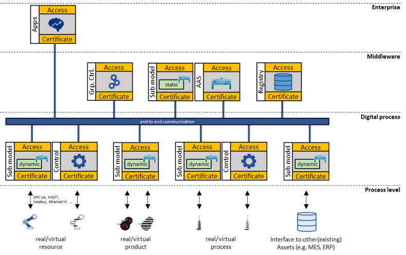

### Digital Twins with Asset Administration Shells



Eclipse BaSyx uses the Asset Administration Shell (AAS) as base technology for <a href="https://www.iese.fraunhofer.de/en/services/digital-twin.html" target="_blank">digital twins</a>. The AAS is the digital identity of an asset and links to AAS sub models that provide asset specific information, simulation models, and services. Eclipse BaSyx supports three kinds of sub models. The same AAS may link to any number of each kind:

*	Static sub models provide access to data that only changes seldomly, such as documents, electronic certificates, data sheets, and digital name plates. Static sub model data may be serialized into files and sent to suppliers or customers, for example when the physical asset is sold or received. Static sub models are created for example with the AASX package explorer and saved as files.
*	Dynamic sub models enable unified access to live asset data. This kind of sub model represents for example raw data, i.e. the state of a device, or higher-level data, such as the location of a product in the process. Dynamic sub models also support behavior (using program code) that implements data preprocessing and analysis. Dynamic sub models are created with the Eclipse BaSyx Software Development Kits (SDKs.) 
*	Control component sub models enable unified access to asset operation modes, services, and capabilities. They are one foundation for the service-oriented architecture of Eclipse BaSyx.	

### Eclipse BaSyx Architecture

Eclipse BaSyx realizes a virtual manufacturing plant. It connects all digital twins to a virtual communication bus that enables end-to-end connectivity across layers, and optionally across companies.

*	**Enterprise level**
Applications on the enterprise level use digital twins to control, optimize and monitor the digital factory, and to negotiate with external stakeholders.

*	**Middleware level**
The middleware consists of asset administration shells for important systems, devices, products, and processes. Group control components orchestrate the manufacturing process based on recipes. The registry service enables localization of AAS and sub models. 

*	**Digital process level**
The digital process level consists of dynamic sub models that interface with physical assets and enable access to their state and services. Control components implement service interfaces for controlling resources and processes.

*	**Process level**
The process level is the manufacturing process and its assets, which may be real or simulated assets. Assets may be physical, or non-physical, and cover all existing systems such as ERP and MES systems, PLM systems, and databases. The real-world assets interact with dynamic sub models and control components through OPC-UA, MQTT or field bus protocols.

### AAS – Higher-level Interfaces



Digital twins realize a high-level interface to factories, manufacturing processes, and assets. A single AAS sub model enables access to raw device data, e.g. the state (open/closed) of a light barrier by providing a facade that delegates requests for example to the device OPC UA servers.

Other sub models combine this data into a digital twin that tracks for example the position of an asset in a factory, and therefore implements a higher-level view based on the combined data from multiple assets. Digital Twins therefore create hierarchies to implement more abstract views and services that improve understandability and controllability of complex manufacturing environments, and that therefore decrease maintenance and development cost.

### Data Bridge



The Eclipse BaSyx data bridge connects real and simulated assets with Eclipse BaSyx dynamic sub models. It supports a variety of IoT, IIoT protocols, such as OPC UA, MQTT, http/REST, as well as field bus protocols.

With the MQTT protocol, sub models can notify subscribers about relevant changes in property values and other relevant events to avoid the need to constantly poll values.

### Data Storage

The Eclipse BaSyx enables integration with SQL, NoSQL databases, and S3 cloud storage. The engineer has the flexibility to decide what is the best storage design given the use case. 

It supports easy connectivity with Postgres or MongoDB via configuration files. AAS, sub models, and property values can then be persisted according to the need. Integration with S3 enables saving sub models and data in the cloud in order to perform robust data analysis using for example artificial intelligence and big data methods.

### Service-oriented Manufacturing Architecture



Service-Oriented Architectures are the key to changeable systems. Eclipse BaSyx implements a service-oriented manufacturing architecture that operates on manufacturing services, and product recipes. 

Assets export re-useable services via control components that implement re-useable and parameterizable tasks, such as the drilling of individual holes. Services are not product specific, in fact, they have no information about the product that they are creating. Production processes are created by orchestrating services into production processes. Group control components utilize the unified interface of control components to combine services into processes. Group control components implement the same interface. Therefore, a hierarchy of group control components can implement complex hierarchical processes.

This is based on recipes that are defined in the Digital Twins of products. AAS sub models define recipes with the required process for creating a product. AAS sub models of Device Digital Twins define capabilities, and describe the quality of available production services, as well as associated cost and additional information, such as the required CO2 footprint. The orchestrator (we use the Camunda Engine) evaluates product and device Digital Twins, calculates schedules and production plans, controls the manufacturing of products, and therefore implements an efficient Lot-Size 1 production. Operating of multiple orchestrators in hierarchies improves scalability.

### Eclipse BaSyx - Main Components

<!---->
**Asset Administration Shell (AAS) Server component**

- Provides AAS to other components
- Serialize/Load AAS from/to AASX, JSON, XML

<!---->
**AAS Server component (for sub models)**

- Enables distributed deployment of sub-models
- Support sub models with active code (e.g. preprocessing)

### 

<!---->
**AAS Registry component**

- Enables lookup and retrieval of AAS descriptors
- WiP: Cascading of AAS registries

### 

<!---->
**Storage components**

- Persist data. Server/Registry components do not maintain a state.

### 

<!---->
**Ready-to-use applications for live data analysis**

- Eclipse Grafana integration (Dashboard application)
- Streamsheets integration (Real-time Excel)

### 

<!---->
**Live event handling application**

- NodeRED integration (automated event processing)

### 

<!---->
**Device connectivity**

- Support for OPC-UA, MQTT, HTTP
- WiP: PLC4X integration for fieldbus protocols

### 

<!---->
**True digital twins**

- Control components and group components
- Enable controlling of processes and process steps

