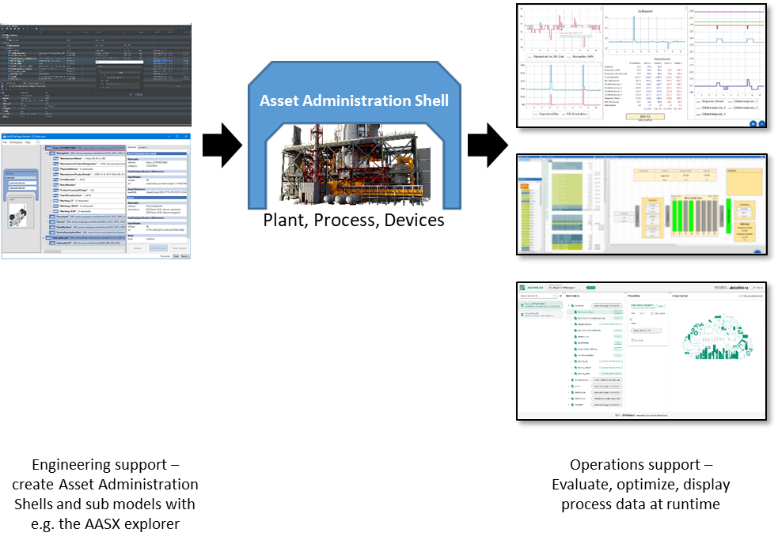
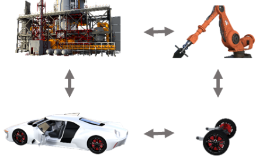
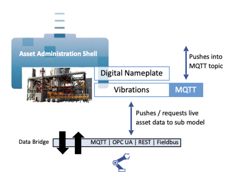
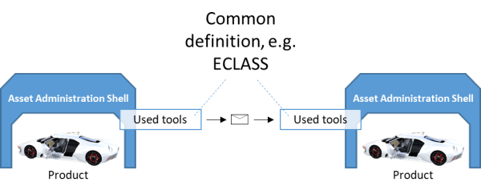

<!--  -->

### End-to-End Digitization
End-to-end digitization integrates all assets into one virtual space. It realizes a holistic digital twin that covers all kinds of assets – for example devices, products, and processes. This enables virtualization and optimization of individual assets, manufacturing plants, and whole supply chains.

 
### Lot Size 1 Production

Changes in automation processes requires developers to adapt PLC programs, MES components, and requires the testing of all changes. Every problem that occurs delays the re-start of a production line, and is therefore highly expensive. Complicated legal and negotiation processes, as well as effort consuming certifications evenincrease the cost of changing a product or a supply chain. Manufacturing of small lot sizes is therefore not economic in highly automated environments. 

Eclipse BaSyx enables an efficient lot-size one production: Digital twins track the whole production process and speed up certification. Our service oriented architecture encapsulates PLC programs as re-useable services. Changes in production processes can be virtually tested, downtimes are reduced to a minimum. This enables the manufacturing of customer specific products with a unique recipe, with unique production steps, and parameter.

### Integrating Live Process Data from Assets

Digital Twins are complete digital representations of physical assets, and therefore, they must reflect the current state of an asset. Eclipse BaSyx connects digital twins to real-world assets with data provider components that communicate through a variety of IoT, and IIoT protocols, such as OPC UA, MQTT, http/REST, and supports also numerous field bus protocols.  

### Unified Interfaces to Assets, Data, and Everything Else


<!-- -->

Digital twins need to integrate different kinds of assets. Eclipse BaSyx implements bidirectional digital twins: a digital twin both represents the current state of an asset, and realizes a unified interface tot hat asset. This simplifies the integration of highly specific devices and software, such as databases, web services, PLM systems, and ontologies.

Eclipse BaSyx Digital Twins therefore simplify the integration of existing data sources with proprietary and specialized APIs. This is commonly used for example to integrate Apache Kafka streams for high-frequency data. With the EclipseBaSyx SDKs, everybody can develop tailored Digital Twins that connect to existing, or specific systems, and provide access to their data and services.

<!--

### Interoperability

Digital twins based on AAS and AAS sub models digitize value chains. This requires e.g. inter-company interactions. Today, these interactions are limited by different protocols and data models, which limit data exchange abilities. 

Exchanging data requires a common understanding with respect to the meaning of data. The AAS and its sub models enable semantic tagging, to provide this meaning. By adding a semantic meaning to services and properties, one ensures that data is understood correctly, even without detail knowledge about underlying data models.

-->

