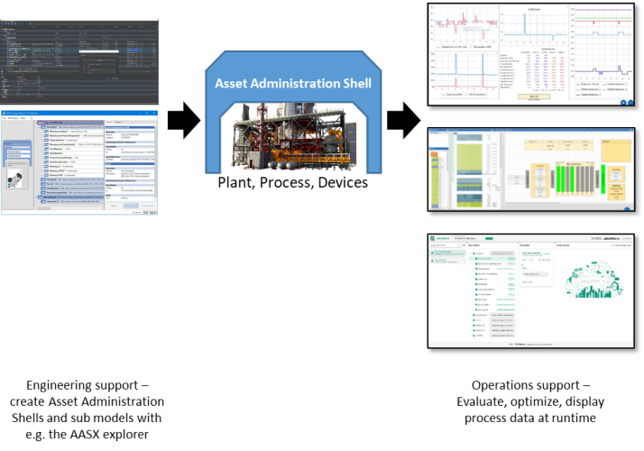

<!--  -->

### Digital Twins

Digital Twins are complete representations of any physical or non-physical real-world asset. They represent the current state of the asset though a harmonized interface, which covers for example the state of an asset, and sensor values. Digital twins also provide simulation models that predict asset behavior in a particular situation, provide evidences for substantiated decisions, and enable what-if analysis. 

The Asset Administration shell is an agreed technical foundation for digital twins. AAS sub models tailor the generic AAS to the specific needs of assets, and provide access to specific properties, states, services, and simulation models.

### Digital Supply Chains

Complex products consist of numerous components from different suppliers. Next-generation use-cases, such as the digital product passport and automated calculation of CO2 footprint requires an information exchange along the value chains. This requires a harmonized interface, and agreed languages and data models. The Eclipse BaSyx Industry 4.0 middleware therefore uses the Asset Administration Shell as foundation for ist digital twins, which has been standardized as IEC 63278-1 ED1.

### Asset Administration Shells (AAS)

Most existing automation systems communicate using proprietary protocols and data models. If for example a sensor is to be replaced, all dependent systems need to be updated as well to implement for example the characteristic curve of a new sensor.

Eclipse BaSyx integrates all assets with their Asset administration Shell (AAS). The AAS is a unified representation for all relevant physical and non-physical assets, e.g. for products, orders, processes, devices, certificates, ERP/MES Systems, and everything else that is relevant. 

Every AAS is represented by at least one digital ID. This might be any unique ID, for example a URI, or the serial number of the represented real-world asset. The same AAS can be reached via multiple IDs, which enables additional IDs that are e.g. bound to a role in a factory.

<!--  -->

### AAS Submodels

Different types of assets require and provide different kinds of information and services. Therefore, also the Digital Twin of an asset must represent its different aspects. Asset Administration Shell sub models define data and service models for specific kinds of data and services, for example to represent a specific kind of sensor. 

A single AAS may define any number of sub models, but every sub model always belongs to exactly one AAS. 

Currently, most AAS sub models that are created are created for a specific purpose. However, ongoing standardization activities cover copmmonly used sub models and ensure a common understanding of a subset of important sub models that need to be exchanged along value chains. 

### AAS – Referencing, Exchange, and Interoperability

<!--  
 -->

Optimizing production processes along value chains requires exchange of digital data. As Eclipse BaSyx represents all relevant assets with Asset Administration Shells, one AAS needs to refer to other AAS or AAS submodels. Therefore, AAS support references that refer to other AAS and sub models by a unique ID. This enables e.g. a product to refer to all devices, processes, and plants that were involved in its manufacturing.

As data exchange also requires a common understanding of data, the AAS and its sub models enable semantic tagging. Semantic tags provide a meaning to properties and services. By adding a semantic tag, one ensures that data is understood correctly, even without detailed knowledge about underlying data models

<!--
### Interoperability

Digital twins based on AAS and AAS sub models digitize value chains. This requires e.g. inter-company interactions. Today, these interactions are limited by different protocols and data models, which limit data exchange abilities. 

Exchanging data requires a common understanding with respect to the meaning of data. The AAS and its sub models enable semantic tagging, to provide this meaning. By adding a semantic meaning to services and properties, one ensures that data is understood correctly, even without detail knowledge about underlying data models.

### Integrating Live Process Data from Assets

Digital Twins shall represent the current state of an asset. Therefore, AAS sub models need to connect to real-world entities, e.g. devices or software systems, and provide access to live data through properties and services. A vibration sub model would for example provide recent measurements from vibration sensors.

Eclipse BaSyx connects digital twins to real-world assets with data provider components that communicate through a variety of IoT, IIoT protocols, such as OPC UA, MQTT, http/REST, as well as field bus protocols with assets. AAS sub models optionally preprocess raw data, and provide data through sub model properties and services. 

Sub models may notify MQTT subscribers about relevant changes in property values to avoid polling of values. 

### Unified Interfaces to Assets, Data, and Everything Else



Digital twins need to integrate a lot of data sources. AAS sub models may therefore serve as „plugins“, i.e. unified interfaces to legacy systems and information that need to be integrated into digitized manufacturing processes.

This simplifies the integration of high specific systems, such as databases, web services, and ontologies that enable e.g. access to PLM data, or recipes. 

This enables the integration of existing data sources with proprietary and specialized APIs, which are not supported by the Eclipse BaSyx data provider component. A common use-case is the integration of e.g. apache Kafka streams. With the Eclipse BaSyx SDKs, everybody can develop tailored AAS sub models that connect to existing, or specific systems, and therefore serve as „plugins“ for the digitized manufacturing process.

### Applications & Tools

Eclipse BaSyx provides pre-configured Industry 4.0 tools, and is compatible with ready-to-use (open-source) toolchains:

* The [*AAS Package Explorer*](https://github.com/admin-shell-io/aasx-package-explorer) enables users to create Asset Administration shells and AAS Sub Models for assets. It also enables the creation of new AAS types and sub model types.
* The BaSyx AAS Viewer application enables users to lookup AAS and sub model from a registry server, and displays AAS contents to enable process tracking.
* The open-source Eclipse Streamsheets application enables real-time data analytics, transformation and analysis.
* The open-source Grafana application visualizes data and enables the creation of dashboards and virtual control rooms.
* The open-source Node.Red application automates reaction to events, e.g. detected unusual sensor values.

-->