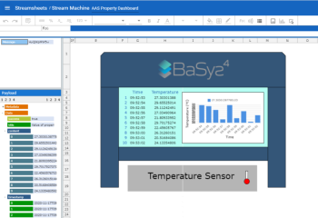
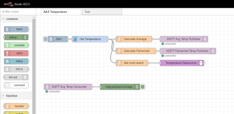

Applications make the benefits of a digitized manufacturing process accessible, because they make a change to the operators of a device, of a manufacturing line, or of a factory. The following applications integrate with Eclipse BaSyx to interact with digitized manufacturing processes and Asset Administration Shells (AAS).
 
## Eclipse Streamsheets

### Real-time data analytics and data processing pipelines

Eclipse Streamsheets is a real-time spreadsheet application that processes data from external sources, processes this data, and optionally provides output. Input/outputs can be connected to Asset Administration Shell sub models to collect/provide data to AAS sub models. Optionally, data input and output pins may be used to connect multiple Streamsheets together into a streaming app. 



- <b>Analyze data and create dashboards:</b> Connect AAS sub model properties to Eclipse Streamsheets input pins. Once data is connected, you can process this data in your spreadsheets, and create visualizations from them that update in real-time, as soon as input data changes. 
- <b>Create documentation:</b> You can use Eclipse Streamsheets to create documentations for your manufacturing processes and manufactured products that track for example deviations from setpoint values. 
- <b>Optimize Processes:</b> Use your collected data to identify optimization potentials.

<!---->

## Grafana 

### Monitor and visualize data in real-time

Grafana creates Dashboards that enable real-time data visualization and monitoring. 



- <b>Monitor data in real-time:</b> Monitor AAS sub model properties and visualize them in real-time
- <b>Create tailored visualizations:</b> Grafana supports a large number of visualizations. Create exactly the visualization that suits the needs of your project. 
- <b>Virtual control room:</b> Aggregate data from multiple AAS and AAS sub models to create virtual control rooms that provide important information at a glance. 

## Node.RED 

### Integrate low-code programming to create event-driven applications. 

Node.RED is a flow-based low-code programming tool. Flows of Node.RED are triggered periodically or by specific events. When triggered, they execute actions, send and receive information, and perform calculations. This way, Node.RED can perform numerous tasks to automate digitized manufacturing processes:



- <b>Integrate hardware devices:</b> Node.RED flows may integrate hardware devices and create tailored adapters to periodically query devices, and to push data into AAS sub model properties.
- <b>Integrate software systems:</b> Node.RED flows can also integrate and synchronize other Systems, such as ERP, PLM, and MES, and synchronize them with AAS sub models. 
- <b>Condition monitoring:</b> Node.RED flows can monitor devices, and execute actions that notify users if deviations from expected values are detected.
- <b>Custom notifications:</b> Node.RED flows can react to numerous events, e.g. changes in AAS sub model properties and execute flows to notify users/operators. 
- <b>Automate periodic tasks:</b> Node.RED flows can be triggered periodically and execute tasks that collect and aggregate data, monitor values, and take actions if necessary.

Node.RED therefore provides a powerful tool to react on changes in values, and numerous means to trigger the execution of flows. Eclipse BaSyx Asset Administration Shells and Sub Models provide a unified access to manufacturing processes, and therefore complement Node.RED by providing data from the OT. 

<!---->
