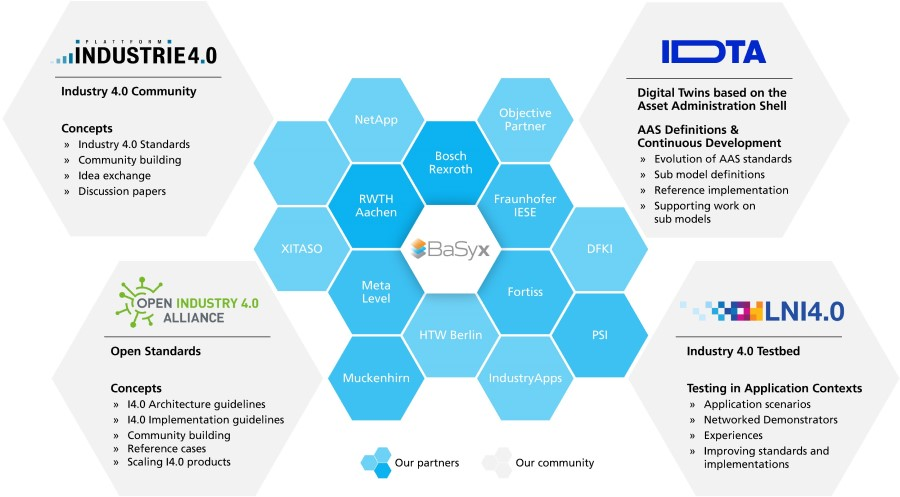
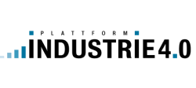
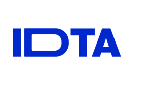
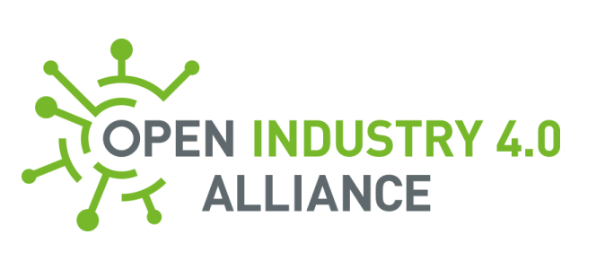

<!--style="color:#0cb2f0"-->

    

    Making the Industry 4.0 happen requires great efforts and strong cooperation between research, academia, industry, the public, and standardization bodies. And it requires an implementation – the code that runs the world of manufacturing. Eclipse BaSyx emerged as commonly used Industry 4.0 middleware and became one of the first implementations of the Asset Administration Shell (AAS), even before it was a standard for digital twins. This is why Eclipse BaSyx is part of the code that enables digitization of manufacturing – that connects machines and IT systems – that runs our world. 
    

    

        
<h2>The Eclipse BaSyx Ecosystem – Code the Future</h2>

    

    

    Eclipse BaSyx is embedded into an ever-growing Ecosystem. A growing number of partners provide products and professional services with Eclipse BaSyx. We are embedded into strong communities. All of us work on standards, continuously improve implementations, and realize projects.
    

    

    Are you a developer, a hobbyist, or interested in using Eclipse BaSyx, and you want to be part of the story?  
    Contact us: <a href="mailto:anfrage@iese.fraunhofer.de">anfrage@iese.fraunhofer.de</a> – or contact one of our partners on the partners website.
    

    

        

            
        

    

    

        
<h2>The Industry 4.0 Community</h2>

    

    

    Regardless of whether you are a software developer, if you run a factory, if you manufacture devices, if you do research, teach, or if you are an interested hobbyist. Eclipse BaSyx helps you to realize Industry 4.0. But the Industry 4.0 community is much bigger. It consists of many major players that together shape the world of manufacturing:
    

    

        

            

                

                
                

                

                    <h3 class="custom_post_link">Platform Industrie 4.0</h3>
                    
The Platform Industrie 4.0 is a joint initiative that puts focus on developing standards and frameworks for the integration of digital technologies in manufacturing, as well as promoting the collaboration between industry and research institutions. Many important ideas and standards were and are created under the umbrella of the Platform Industrie 4.0. Why not having a look on current result and discussion papers? Even the first revisions of the Asset Administration Shell (AAS) were created under the umbrella of Platform Industry 4.0, which turned out to be one of the most important assets in digitizing manufacturing. 

                

            
  
        

    

    

        

            

                

                
                

                

                    <h3 class="custom_post_link">Industrial Digital Twin Association e.V. (IDTA)</h3>
                    
The Industrial Digital Twin Association has the mission of continuously developing the Asset Administration Shell into a foundation of Digital Twins. The IDTA also develops Asset Administration Shell sub models, important data structures that structure Asset Data and enable its use across borders of a single company. Under the umbrella of the IDTA, several working groups have been created that bring industry experts, researches, and end-users together. The working groups focus on the development of for example AAS sub models, reference implementations of the Asset Administration Shell, but also on AAS trainings

                

            
  
        

    

    

        

            

                

                
                

                

                    <h3 class="custom_post_link">Open Industry 4.0 Alliance</h3>
                    
The Open Industry 4.0 Alliance promotes the use of open standards, such as the OPC UA (Open Platform Communications Unified Architecture) communication protocol, which enables secure and reliable communication between machines and systems. The use of open standards ensures that different systems and machines can work together seamlessly, regardless of manufacturer or origin. 

                

            
  
        

    

    

        

            

                

                
                

                

                    <h3 class="custom_post_link">LNI 4.0 Labs Network Industry 4.0</h3>
                    
The goal of Labs Network Industry 4.0 is to facilitate collaboration between research institutions and industry partners to accelerate the adoption of Industry 4.0 technologies. LNI 4.0 also promotes innovation and the development of new technologies that improve productivity, efficiency, and sustainability in manufacturing.

                

            
  
        

    

