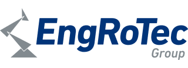

### The Eclipse BaSyx Ecosystem

Eclipse BaSyx is the most advanced Industry 4.0 middleware and control software that is available right now. Do you need help with installation or support during operation? Eclipse BaSyx is supported by an ever-growing ecosystem of professional companies who are happy to assist you with your project. 

###

###

### Solution Developers and Support

These partners realize Industry 4.0 projects with Eclipse BaSyx, and provide support if necessary.

  

    
  

  

   
  

  

  
  

  

  
  

  

  
  

  

  
  

  

  
  

 

###

### Automation Components

These partners sell automation components with Asset Administration Shells that work with Eclipse BaSyx.

  

    
  

  

     
  

  

    
  

 

###

### Training

Education and Training is important. Whether you need an overview on Industry 4.0, or you are interested in a technical deep-dive regarding the realization, we have the perfect training for you.

   
 

###

Do you have questions or would like to have some support from our partners, please feel free to contact us
<a href="mailto:anfrage@iese.fraunhofer.de">anfrage@iese.fraunhofer.de</a>