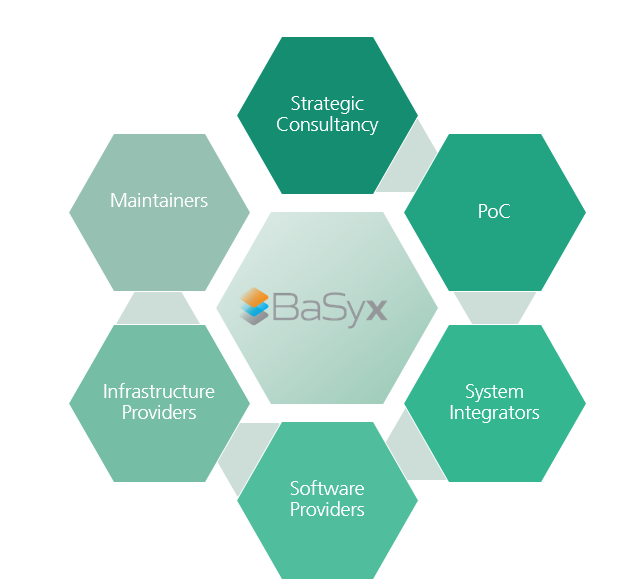
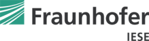
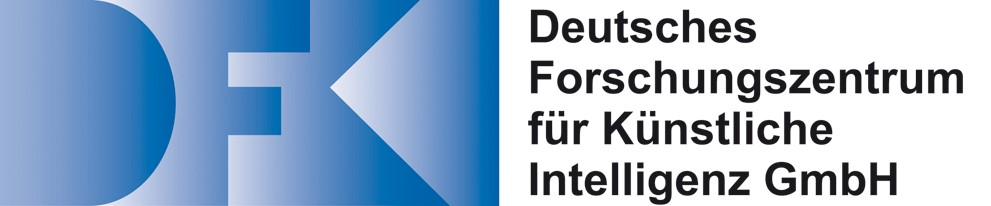
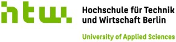
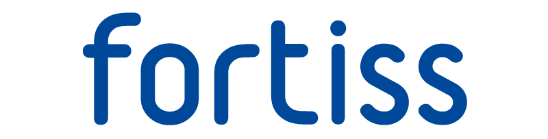
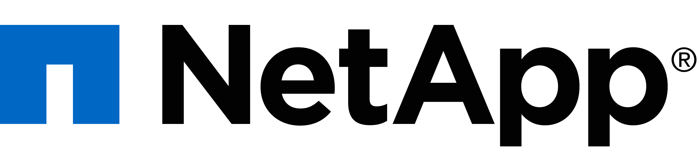
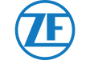
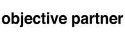

## Eclipse BaSyx Partners

Eclipse BaSyx is supported by an ecosystem of professional companies and research partners which would be happy to assist you in your projects. 

<!--

   

-->

    
<h3>System Concept & Strategic Consulting</h3>

Industry 4.0 will drive a significant change in your system architecture. We guide you through decision taking and planning processes, develop ideas and solution concepts. Would you like to know how Industry 4.0 can be applied to your process? Do you need help with creating a prototype, or a highly specific solution that is far away from off the shelf? We support you!

<ul class="custom_posts" id="posts">
  <li class="custom_post_item">
    

      
    

    

      
<b>Services:</b>  
              - Strategic Consulting & Roadmapping  
              - Digital Twins  
              - Extension & adaptation of Eclipse BaSyx (SDKs, components, functions)  
              - Proof of Concepts  
              - Retrofitting
      

    

    

      
<b>Feel free to contact us:</b> <a>anfrage@iese.fraunhofer.de</a>

    

  </li>  
  <li class="custom_post_item">
    

      
      <!--<h3 class="custom_post_link"><a href="https://neuralvibes.com/blog/more-privacy-on-ios-default-apps/">Deutsches Forschungszentrum für Künstliche Intelligenz (DFKI)</a></h3>-->
    

    

      
<b>Services:</b>  
              - Strategic Consulting  
              - Design and Development of Proof of Concepts 
      

    

    

      
<b>Feel free to contact us:</b> <a>daniel.porta@dfki.de</a>

    

  </li>
  <li class="custom_post_item">
    

      
    

      

        
<b>Services:</b>  
                - Concept development for industrial environments 
                - Consulting for the migration of existing plants based on PLCs 
                - Consulting on BaSys 4.2 for industrial environments
        

    

    

      
<b>Feel free to contact us:</b> <a>stephan.schaefer@HTW-Berlin.de</a>

    

  </li>
  <li class="custom_post_item">
    

      
    

    

        
<b>Services:</b>  
                - Architecture Modelling and Analysis 
                - Engineering Methodology 
                - Proof-of-Concepts 
                - Prototype Development
        

      

      

        
<b>Feel free to contact us:</b> <a>mbse@fortiss.org</a>

    

  </li>
</ul>
<ul class="custom_posts" id="posts">
  <li class="custom_post_item">
    

      
    

    

      
<b>Services:</b>  
              - Industry 4.0 Infrastructure  
              - On-premise and cloud IT solutions 
      

      
<b>Feel free to contact us:</b> <a>ng-IndustrySolutionsDE@netapp.com</a>

    

  </li> 
  <li class="custom_post_item">
    

      
    

    

        
<b>Services:</b>  
                - Consulting services
        

      

      

        
<b>Feel free to contact us:</b> <a>ktroeger@psi.de</a>

    

  </li>
  <li class="custom_post_item">
    

      
    

    

      
<b>Services:</b>  
          - Customer specific solutions  
          - Future proof software architectures  
          - Consulting and workshops
      

    

    

        
<b>Feel free to contact us:</b> <a>info@xitaso.com</a>

    

  </li>
  <!--
  <li class="custom_post_item">
    

      
    

    

      
<b>Services:</b>  
              - POC 
              - Consulting
      

    

    

      
<b>Feel free to contact us:</b> <a>daniel.porta@dfki.de</a>

    

  </li>
  --> 
</ul>
<!--
<ul class="custom_posts" id="posts">
  <li class="custom_post_item">
    

      
    

    

        
<b>Services:</b>  
                - xxxxxxxxx
        

      

      

        
<b>Feel free to contact us:</b> <a>xxxxxx</a>

    

  </li>
</ul>
-->

    
<h3>Coaching & Training</h3>

Coaching and Training is important. Whether you need an overview of Industry 4.0 concepts, or you are interested in a technical deep dive regarding the realization, we have the perfect training for you. 

<ul class="custom_posts" id="posts">
    <li class="custom_post_item">
      

        
      

      

        
<b>Services:</b>  
                - Training in I4.0 Basic Concepts 
                - Training in BaSyx SDKs and Core Components 
                - Coaching in Software Best Practices  
                - Coaching in Systems Design
        

        
<b>Feel free to contact us:</b> <a>anfrage@iese.fraunhofer.de</a>

      

    </li>  
    <li class="custom_post_item">
      

        
    

        

          <!--<h3 class="custom_post_link"><a href="https://neuralvibes.com/blog/more-privacy-on-ios-default-apps/">Deutsches Forschungszentrum für Künstliche Intelligenz (DFKI)</a></h3>-->
          
<b>Services:</b>  
                  - Industry 4.0 trainings  
                  - Industry 4.0 coaching 
          

          
<b>Feel free to contact us:</b> <a>daniel.porta@dfki.de</a>

        

    </li> 
  </ul>

    
<h3>Integrators & Distributers</h3>

Integrating Eclipse BaSyx with existing systems, devices and production environments can be a challenging task. If you need help, feel free to ask our partners. They will also offer support if necessary. 

<ul class="custom_posts" id="posts">
  <li class="custom_post_item">
    

      
    

    

      
<b>Services:</b>  
              - Setting up and adapting AAS 
              - Software projects
      

      
<b>Feel free to contact us:</b> <a>hanna.schier@meta-level.de</a>; <a>peter.raber@meta-level.de</a>

    

  </li>  
  <li class="custom_post_item">
    

      
    

      

        
<b>Services:</b>  
                - Implementation of AAS type 2  
                - Integration with OPC-UA and REST communication interfaces  
                - Customization in the web-based GUI for the creation and use of AAS
        

    

    

      
<b>Feel free to contact us:</b> <a>stephan.schaefer@HTW-Berlin.de</a>

    

  </li>
  <li class="custom_post_item">
    

      
    

    

      
<b>Services:</b>  
          - ERP system integration  
          - Asset as a service  
          - Software projects  
      

      
<b>Feel free to contact us:</b> <a>nina.hansen@objective-partner.com</a>

    

  </li> 
  <li class="custom_post_item">
    

      
    

    

      
<b>Services:</b>  
              - Consulting in MES system integration
      

      
<b>Feel free to contact us:</b> <a>ktroeger@psi.de</a>

    

  </li>
  <!--
  <li class="custom_post_item">
    

      
    

    

      
<b>Services:</b>  
          - xxxxxxxxxxx
      

      
<b>Feel free to contact us:</b> <a>xxxxxxxxxxxxxx</a>

    

  </li> 
  -->
</ul>
<ul class="custom_posts" id="posts">
  <li class="custom_post_item">
    

      
    

    

      
<b>Services:</b>  
          - Agile development of solutions supporting AAS  
          - Integration of AAS and BaSyx in ecosystem  
          - Digital Nameplate
      

    

    

        
<b>Feel free to contact us:</b> <a>info@xitaso.com</a>

    

  </li> 
</ul>

    
<h3>Tooling</h3>

Our Partners offer tools and solutions to realize Industry 4.0 with Eclipse BaSyx.

<ul class="custom_posts" id="posts">
  <li class="custom_post_item">
    

      
    

    

      
<b>Solution:</b>  
          - <a href="https://www.meta-level.de/en/products/aas-suite-en/" target="_blank" class="external">AAS Suite with AAS Designer</a> 
          - <a href="https://www.meta-level.de/en/products/aas-suite-en/" target="_blank" class="external">AAS Marketplace</a>
      

      
<b>Feel free to contact us:</b> <a>hanna.schier@meta-level.de</a>; <a>peter.raber@meta-level.de</a>

    

  </li> 
  <li class="custom_post_item">
    

      
    

    

      
<b>Solution:</b>  
          - <a href="https://objective-partner.de/en/themen/industrie-4-0/" target="_blank" class="external">AAS Editor</a>
      

      
<b>Feel free to contact us:</b> <a>nina.hansen@objective-partner.com</a>

    

  </li> 
  <li class="custom_post_item">
    

      
    

    

      
<b>Solution:</b>  
          - <a href="https://xitaso.com/en/competences/digital-twin/" target="_blank" class="external">Mnestix Demonstrator</a>
      

    

    

        
<b>Feel free to contact us:</b> <a>info@xitaso.com</a>

    

  </li> 
</ul>
