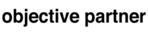

    
<h2>Asset-as-a-Service with Eclipse BaSyx</h2>

    
The objective partner AG is a technology consulting company located in Weinheim. Over the past years, objective partner AG has developed a substantial expertise in implementing Eclipse BaSyx-based solutions for their clients, leveraging the middleware to build customized, scalable, and secure industrial automation systems.

    
During Hannover Messe 2022, Objective Partner showcased a Corona Test Robot that can autonomously perform nasal swabs for corona rapid tests. The robot solution for Covid tests was realized together with SAP Franka Emika GmbH. This solution demonstrates the new “Asset as a Service” concept that uses Asset Administration Shells and Eclipse BaSyx to realize dynamically bookable asset services and flexible payment models.

    
With Asset-As-A-Service, new Asset capabilities can be downloaded and billed on-demand, which lowers investment costs especially for small and medium sized companies.

    <figure class="img-right"></figure>
    <h5>Name:                Objective Partner AG</h5>
    <h5>Headquarters:        Weinheim, Germany</h5>
    <h5>Sector:              Software Development & Consultancy </h5>

